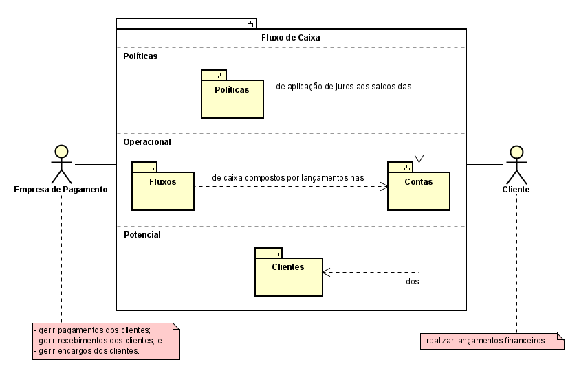
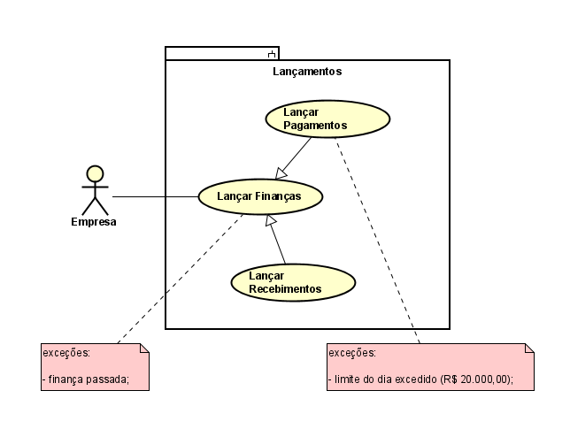
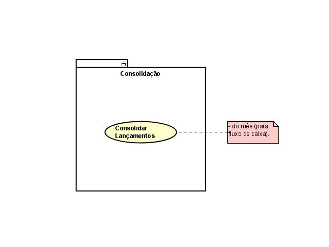
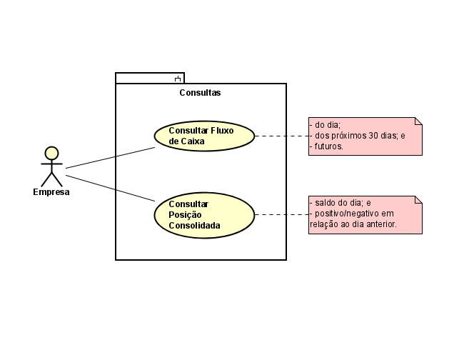
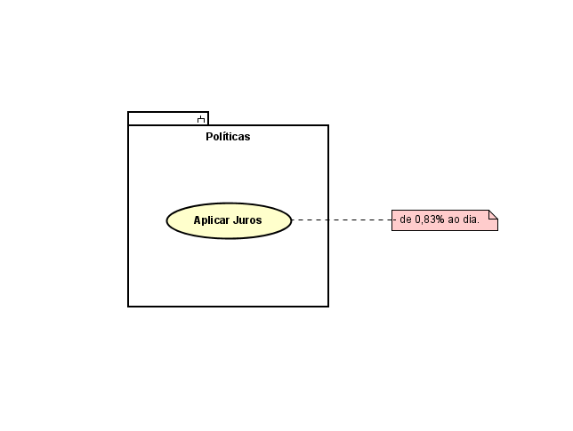
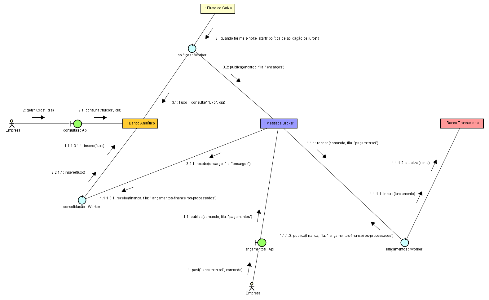
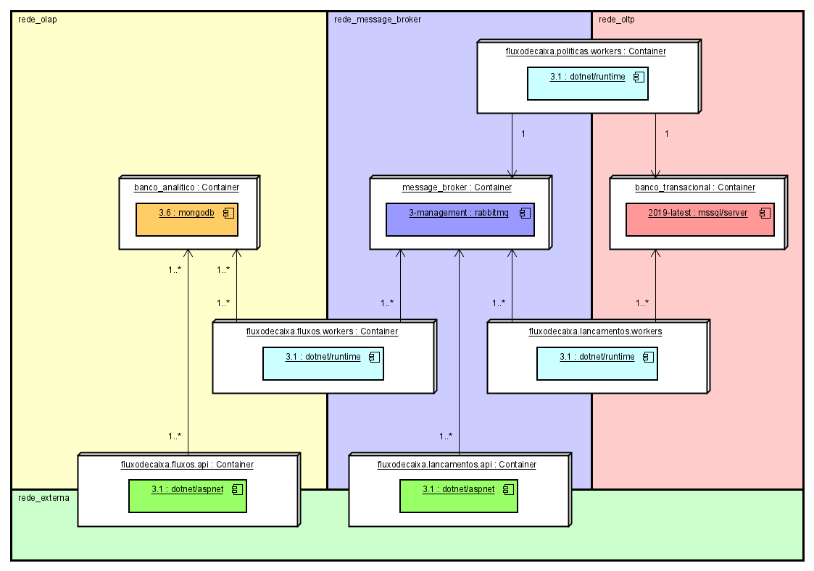

# Fluxo de Caixa

## Casos de Uso

### Contexto do Sistema

### Módulo de Lançamentos

### Módulo de Consolidação

### Módulo de Consultas

### Módulo de Políticas

## Implementação

### Message Broker

Filas:
- pagamentos
- recebimentos
- lancamentos-financeiros-processados

## Implantação

### Postman Collection

[Postman Collection](tools/postman_collection.json)
