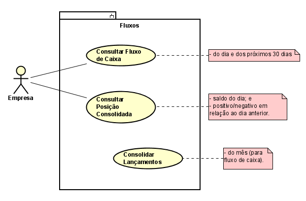

# Fluxo de Caixa

Uma empresa precisa realizar lançamentos financeiros e gerir seus pagamentos, recebimentos e encargos.

## Requisitos

- É necessário uma grande capacidade de processamento devido ao grande volume de lançamentos financeiros.
- O fluxo de caixa é composto pelos lançamentos financeiros processados com sucesso.
- É necessário uma consulta do fluxo de caixa do dia e dos próximos 30 dias, já com os lançamentos futuros.
- Deseja-se calcular a posição de caixa, que basicamente mostra o saldo dos lançamentos do dia e se é positivo ou negativo em relação ao dia anterior.

## Regras de Negócio

- Não é permitido fazer lançamentos no passado.
- A empresa tem um limite para ficar negativo que não pode superar o valor de **R$ 20.000,00** no dia; caso ultrapasse não será possível fazer novos lançamentos no dia e qualquer tentativa de lançamento deve falhar e o motivo deve ser informado.
- Caso o valor da conta esteja negativo sobre o mesmo incidem juros de **0,83%** ao dia.

## Modelo de Negócio

### Lançamento Financeiro

```YAML
tipo_de_lancamento: Tipos de lançamento (pagamento e recebimento),
descricao: Qualquer descrição sobre o pagamento,
conta_destino: Conta do destinatário,
banco_destino: Banco do destinatário,
tipo_de_conta: Se a conta é corrente ou poupança,
cpf_cnpj_destino: Número formatado do CPF ou CNPJ,
valor_do_lancamento: Valor em reais do lançamento no formato (R$ 0.000,00),
encargos: Valor em reais do lançamento no formato (R$ 0.000,00),
data_de_lancamento: Data em que o lançamento ocorreu no formato (dd-mm-aaa)
```

### Fluxo de Caixa

Fluxo de caixa do dia e dos próximos 30 dias.

```YAML
- data: 31-12-2018,
  entradas:
    - data: Data em que a entrada foi lançada no fluxo de caixa no formato (dd-mm-aaaa),
      valor: Valor da entrada em reais no formato (R$ 0.000,00)
  saidas:
     - data: Data em que a saída foi lançada no fluxo de caixa no formato (dd-mm-aaaa),
       valor: Valor da saída em reais no formato (R$ 0.000,00)
  encargos:
     - data: Data em que o encargo foi lançada no fluxo de caixa no formato (dd-mm-aaaa),
       valor: Valor do encargo em reais no formato (R$ 0.000,00)
  total: Total de lançamentos do dia em reais no formato (R$ 0.000,00),
  posicao_do_dia: Comparando com o dia anterior se houve aumento do caixa ou queda em percentual no formato (000,0%)
```

## Casos de Uso

### Contexto do Sistema


### Módulo de Lançamentos


### Módulo de Fluxos



### Módulo de Políticas


## Implementação


### Message Broker

#### Filas

- pagamentos
- recebimentos
- lancamentos-financeiros-processados

## Implantação


# Ferramentas

[Postman Collection](tools/postman_collection.json)
